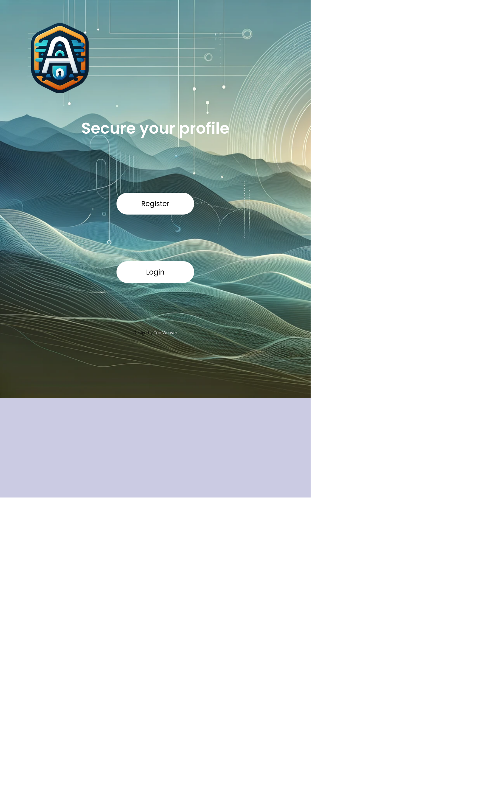

# auth-app-client

[](https://app.netlify.com/sites/auth-guard-app/deploys)

Authentication app built using React, Express, Javascript, MongoDB and JsonWebToken(JWT).



## Built With

- React with Vite

## Live Demo

[Click here](https://auth-guard-app.netlify.app/)


## Getting Started

To get a local copy up and running follow these simple example steps.

### Prerequisites

Nodejs

### Setup

Install dependencies with:

```
yarn install
```


### Usage

Start server with:

```
    yarn dev
```

Open `http://localhost:5173/` in your browser.

### Run tests

```
    yarn test
```

### How to use the site
Make sure the server is running
- Go to http://localhost:5173/ in your web browser
   
- Follow the links on the site to access the available features, including sign up and sign in functionality.


### Deployment
- You can deploy on
 - [Netlify](https://app.netlify.com).


## Authors

👤 **Marylene Sawyer**
- Github: [@Bluette1](https://github.com/Bluette1)
- Twitter: [@MaryleneSawyer](https://twitter.com/MaryleneSawyer)
- Linkedin: [Marylene Sawyer](https://www.linkedin.com/in/marylene-sawyer)

## 🤝 Contributing

Contributions, issues and feature requests are welcome!

Feel free to check the [issues page](https://github.com/Bluette1/auth-app/issues).

## Show your support

Give a ⭐️ if you like this project!


## 📝 License

This project is [MIT](https://opensource.org/licenses/MIT) licensed
